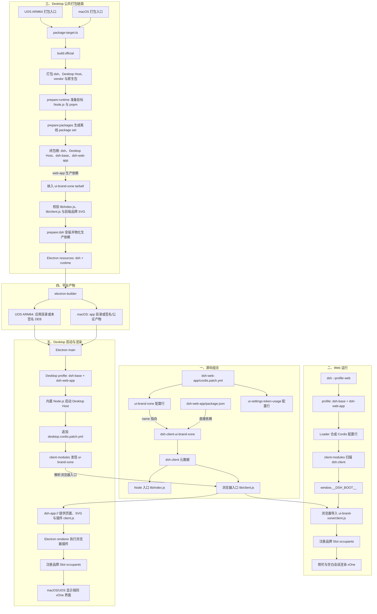

# xOne 插件在 Web、macOS 与 UOS Desktop 的插入、打包和渲染流程

## 摘要

本文说明 `@deepseek-ai/dsh-client-ui-brand-xone` 如何进入 `dsh-web-app`，以及同一插件如何在 Web、macOS Desktop 和 UOS ARM64 Desktop 中完成解析、加载与界面渲染。macOS 与 UOS 使用同一份 dsh Web 组合和 Desktop Host；两者只在目标 Node.js、Electron 平台参数、签名策略与最终安装产物处产生分支。

## 目录

- [关键结论](#关键结论)
- [端到端流程图](#端到端流程图)
- [源码组合](#源码组合)
- [Web 运行与渲染](#web-运行与渲染)
- [macOS 与 UOS Desktop 打包](#macos-与-uos-desktop-打包)
- [Desktop 运行与渲染](#desktop-运行与渲染)
- [故障定位](#故障定位)
- [代码入口](#代码入口)
- [验证边界](#验证边界)

## 关键结论

`ui-brand-xone` 不是 Desktop 专用 bundle。它是普通 Cordis 浏览器插件，由 `dsh-web-app` 在默认浏览器名录中直接挂载；`ui-settings-token-usage` 使用相同的装配方式。

Desktop profile 只把 `dsh-base` 与 `dsh-web-app` 作为内置 bundle。打包器从这两个根遍历生产依赖，因此会沿 `dsh-web-app → dsh-client-ui-brand-xone` 自动纳入 xOne 的 Node 入口和浏览器入口，无需第三个 xOne profile 层。

升级已有安装时，随附 `web` profile 会把精确匹配的旧三层列表迁移为当前两层模板；Desktop profile 会移除旧的内置 xOne 位置，并保留后续外部插件。自定义 profile 名称和其他 bundle 列表不会被自动改写。

Web 通过 HTTP 提供前端与插件资源；Desktop 不启动 Web 服务器，而是通过 `dsh-app://`、Desktop Host 和分帧字节管道提供相同的前端与插件资源。两条路径最终都在浏览器 Cordis 上下文中执行 xOne 的 `client.js`，并向通用 Slot 注册侧栏图标、侧栏名称、空白会话图标和空白会话标题。

## 端到端流程图

## 源码组合

`packages/bundle/web-app/package.json` 把 xOne 声明为生产依赖，`packages/bundle/web-app/cordis.patch.yml` 则插入 `ui-brand-xone` 配置行。依赖声明负责让包进入安装和打包闭包，配置行负责让 Loader 实际创建插件条目；缺少其中任意一项都会导致包存在但插件不运行，或配置引用了未安装的包。

`packages/client/ui-brand-xone/package.json` 只声明 `dsh.client` 元数据，不再声明 `dsh.bundle.patch`。Node 入口用于 Loader 占位，浏览器入口执行 locale 和 Slot 注册；该插件不拥有独立 profile patch。

## Web 运行与渲染

`dsh --profile web` 按顺序组合 `dsh-base` 与 `dsh-web-app`。Loader 创建 `ui-brand-xone` 后，`client-modules` 读取其 `dsh.client` 元数据，并把浏览器入口加入启动清单。浏览器加载 `client.js` 后，插件等待侧栏与会话声明四个品牌 Slot，再注册对应 occupant；React 随后在侧栏和空白会话中渲染 xOne 文案与图片。

Web 前端从根路径加载 `/jushu-logo.svg` 与 `/bloub-nuage-attentif-bleu-anime.svg`。这两个文件属于 Web 前端静态资源，不嵌入 xOne JavaScript bundle。

## macOS 与 UOS Desktop 打包

macOS 和 UOS 都从 `package-target.ts` 进入同一条公共流水线：构建官方客户端、打包第一方依赖、准备目标 Node.js 与 pnpm、选择离线生产依赖闭包、物化 `resources/dsh`，最后调用 electron-builder。离线闭包以 dsh、Desktop Host、`dsh-base` 和 `dsh-web-app` 为根；xOne 通过 `dsh-web-app` 的生产依赖进入闭包。

macOS ARM64 使用 `package:desktop:mac:arm64` 或对应的 `:dir` 入口，并且必须在 macOS 主机执行。发布打包执行签名与公证；本地 `--unsigned --dir` 模式使用 ad-hoc 签名，不生成合格发布产物。

UOS ARM64 使用 `package:desktop:linux:arm64` 或对应的 `:dir` 入口，并且必须在 Linux ARM64 主机执行。当前 Linux ARM64 只支持本地未签名 DEB 或未打包应用目录，不生成自动更新元数据、发布完成记录或上传任务。

两个平台都会检查 xOne 的 `lib/index.js`、`lib/client.js`，以及 Web 前端中的两张品牌 SVG。此检查用于阻止缺少运行入口或图片资源的 Desktop 产物进入 electron-builder。

## Desktop 运行与渲染

Electron 启动时读取应用内的 Node.js、pnpm 与 `resources/dsh`，并由 `DesktopProjectManager` 准备仅包含 `dsh-base` 与 `dsh-web-app` 的内置 profile。Desktop Host 合成这两个 bundle 后追加 `apps/desktop-host/config/desktop.cordis.patch.yml`，关闭 Web 服务器、自动开浏览器和 HMR 等 Web 专用配置，并替换 Desktop 连接与目录选择器。

如果保留的 Desktop profile 仍以旧的 `dsh-base + dsh-web-app + ui-brand-xone` 内置列表开头，`DesktopProjectManager` 会在运行时状态的快速复用判断前移除第三项。该迁移不执行 pnpm，并保留列表后方已安装且启用的外部插件。

Desktop Host 从物化的 `node_modules` 解析 `ui-brand-xone`。Electron renderer 请求 `dsh-app://app/index.html` 后，Desktop Host 通过 `dsh-app://` 返回前端文件、品牌 SVG 和 `/plugins/.../client.js`；请求与流式响应通过分帧字节管道在 Electron 与内置 Node.js 进程之间传输，不监听本地 HTTP 端口。

浏览器入口在 Electron renderer 中执行，后续 locale、Slot 注册和 React 渲染与普通 Web 页面相同。因此 macOS 与 UOS 不需要各自实现品牌逻辑，也不应在平台专用 overlay 中重复插入 xOne。

## 故障定位

| 现象 | 优先检查 | 说明 |
| --- | --- | --- |
| token usage 生效，但 xOne 不生效 | `dsh-web-app` 是否同时具有 xOne 生产依赖和 `ui-brand-xone` 配置行 | 两者是同级浏览器插件；只安装包但不创建配置行不会运行 |
| Web 生效，macOS/UOS 都不生效 | Desktop 离线 package set、`resources/dsh/node_modules` 和 profile bundle 列表 | 两个平台共享 Desktop 包闭包与启动组合，通常不是平台渲染差异 |
| 文字生效但图片损坏 | Web 前端 dist 中的两个 SVG 与 `dsh-app://` 静态资源响应 | 文案来自插件，图片来自 Web 前端静态资源 |
| 包中有 xOne，但 Host 报插件解析失败 | `dsh-web-app` 的生产依赖是否被物化，以及 xOne 的两个入口文件是否存在 | tarball 存在不等于运行时 `node_modules` 能解析该包 |
| Web 与 Desktop 都退回通用品牌 | `client.js` 是否成功加载，以及四个 Slot 声明是否存在 | 插件只在声明存在时注册 occupant，加载失败或声明缺失都会显示回退内容 |

## 代码入口

- [`packages/bundle/web-app/package.json`](../../packages/bundle/web-app/package.json)——xOne 的生产依赖所有者。
- [`packages/bundle/web-app/cordis.patch.yml`](../../packages/bundle/web-app/cordis.patch.yml)——`ui-brand-xone` 与 `ui-settings-token-usage` 的默认配置行。
- [`packages/client/ui-brand-xone/package.json`](../../packages/client/ui-brand-xone/package.json)——浏览器插件元数据与打包文件列表。
- [`packages/client/ui-brand-xone/src/client/index.ts`](../../packages/client/ui-brand-xone/src/client/index.ts)——locale 与四个品牌 Slot occupant 的注册入口。
- [`apps/desktop/src/core-package-set.ts`](src/core-package-set.ts)——Desktop bundle 根、xOne 入口文件和品牌 SVG 校验清单。
- [`apps/desktop/scripts/package-target.ts`](scripts/package-target.ts)——macOS/UOS 公共打包编排。
- [`apps/desktop/scripts/prepare-package-set.ts`](scripts/prepare-package-set.ts)——离线生产依赖闭包选择。
- [`apps/desktop/scripts/prepare-dsh.ts`](scripts/prepare-dsh.ts)——生产依赖物化、运行时校验和冒烟启动。
- [`apps/desktop-host/src/index.ts`](../desktop-host/src/index.ts)——Desktop profile 合成、静态资源与插件 bundle 响应。
- [`apps/desktop-host/config/desktop.cordis.patch.yml`](../desktop-host/config/desktop.cordis.patch.yml)——Web 组合到 Desktop 组合的覆盖层。
- [`apps/web/tests/desktop-brand.e2e.ts`](../web/tests/desktop-brand.e2e.ts)——不附加 xOne overlay 的默认品牌浏览器验证。

## 验证边界

仓库测试验证默认 Web 组合、Desktop 离线包闭包、必需入口文件和真实浏览器渲染。完整 macOS 发布仍需具备签名与公证凭据的 macOS 环境；完整 UOS DEB 仍需在原生 Linux ARM64 主机生成并执行安装后验证。
